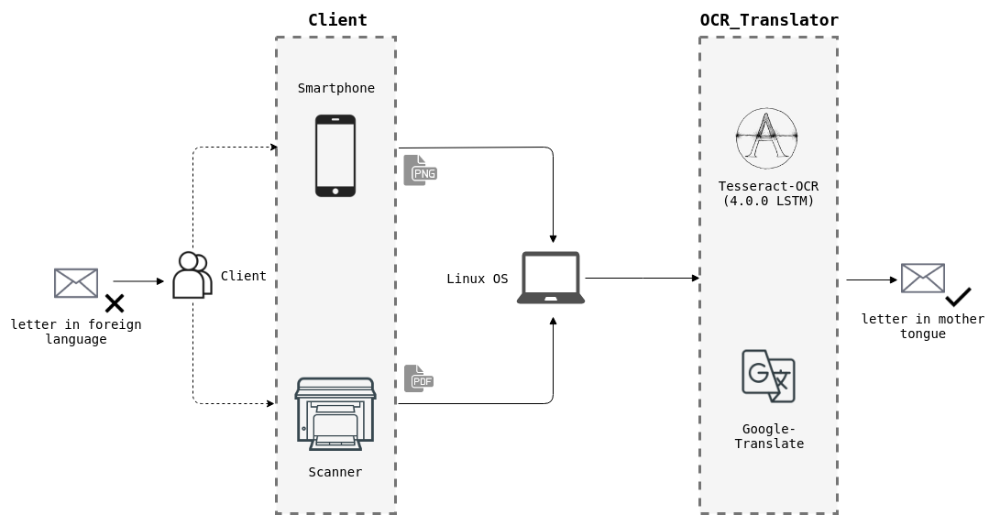

# OCR Translator (Linux OS)
Keywords: `OCR`, `Tesseract-OCR`, `Google Translate`, `Shell Script`, `Linux` 

## 1. Introduction: OCR Translator

Immigrants often struggle understanding letters in a foreign language received by mail. 
OCR Translator aims to overcome language barriers, by using Tesseract-OCR and Google Translate. 

## 2. Workflow

**notice**: the preferred way is using a flatbed scanner, camera-based functionality will be added in future releases.

## 3. Config 

### 3.1 User

Setup (Python2.7):  
    
    # install pip
    sudo apt-get install python-pip
    
    # install git
    sudo apt-get install git
    
    # clone repo
    https://github.com/Nikolai10/OCR_Translator.git
    
    # navigate to ./OCR_Translator; install packages
    python2.7 -m pip install -r requirements.txt
    
Usage:

    # navigate to ./src/; run tool (help)
    python2.7 OCRTranslator_CL.py -h
    
    # example call
    python2.7 OCRTranslator_CL.py ../resources/test.png en de --out_file '../resources/test_de.txt'

### 3.2 Developer

Setup:

    # navigate to ./anaconda 
    conda env create --file environment.yml
    
    # activate OCR_Translator_env
    source activate OCR_Translator_env
    
    # use Jupyter notebook or specify the location of the new virtual environment in your IDE
    # contribute
    
**Notes:**

- currently supported data types: PDF, png
- one page only (multiple pdf pages won't work)    
    
## 4. Resources

- [Tesseract-OCR](https://github.com/tesseract-ocr/tesseract)
- [Google Translate](https://pypi.org/project/googletrans/)

    
